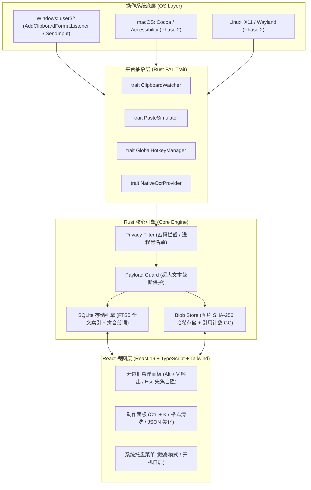

# clip (Clipboard Manager)

<p align="center">
  <strong>📋 极轻量、跨平台的系统级桌面剪贴板历史管理器</strong><br>
  <em>基于 Tauri v2 + React + TypeScript + Rust 打造 · 内存常驻仅 ~25MB · 原生离线 OCR · 毫秒级回填</em>
</p>

<p align="center">
  <a href="https://github.com/atengk/clip/actions/workflows/ci.yml">
    
  </a>
  <a href="https://github.com/atengk/clip/releases">
    
  </a>
  <a href="./LICENSE">
    
  </a>
  <a href="./CONTRIBUTING.md">
    
  </a>
  
  
  
</p>

---

## 📖 项目简介 (Overview)

在日常高频多窗口操作与编程开发中，原生剪贴板仅保留单次复制，历史极易丢失；而传统基于 Electron 的剪贴板工具静默常驻内存高达 150MB+，启动缓慢且占用系统资源。

**`clip`** 是一款专为开发者与重度键盘用户打造的**系统级轻量剪贴板历史管理器**：
- **极致轻量**：采用 **Tauri v2 + Rust 2021** 内核，依托系统自带 WebView2/WebKit 渲染，后台静默常驻内存严格控制在 **$25\sim 35\,\text{MB}$**，安装包仅 **~10MB**；
- **键盘优先**：全局热键 `Alt + V` 毫秒级呼出，首 9 项支持数字键 `1~9` 瞬间回填；
- **隐私坚守**：自动识别 1Password / Bitwarden 等密码管理器标记并彻底拦截，界面敏感字段自动脱敏打码防窥屏；
- **效率神器**：内置队列连贴模式（Paste Queue FIFO）、拼音首字母模糊检索、多格式文本清洗与系统级 0MB 体积离线原生 OCR。

---

## ✨ 核心特性 (Key Features)

- ⚡ **极速唤出与回填 (Fast-Paste)**：`Alt + V` 在当前活动显示器中央偏上黄金分割点居中弹出，支持按数字键 `1~9` 或 `Enter` 瞬间回填至前台原窗口；
- 🔄 **队列连贴 (Paste Queue)**：`Alt + Shift + C` 开启批量收集模式，连续复制多项后在目标窗口连按 `Ctrl + V` 依次（FIFO）出队粘贴，减少 80% 窗口切换；
- 🔤 **拼音首字母模糊检索 (Pinyin Matcher)**：集成 SQLite FTS5 引擎，输入 `wx` 即可秒级定位“微信”，支持空格切分多词 AND 模糊匹配；
- 🔍 **原生离线文字提取 (Native OCR)**：直接调用 Windows 原生 `Windows.Media.Ocr` API 提取图片文字，**0MB** 安装包额外体积增量，100% 离线隐私安全；
- 🛠️ **动作面板 (Action Palette)**：按 `Ctrl + K` 或 `Tab` 唤出操作浮层，支持一键去除多余空行、驼峰/下划线命名转换、格式化 JSON 与强制纯文本；
- 📝 **常用短语模板 (Snippets)**：独立 Tab 维护高频文本与代码片段，支持 `{current_date}`、`{time}` 等动态占位符；
- 🛡️ **密码拦截与防窥打码 (Privacy & Masked View)**：严格遵循 `Clipboard Viewer Ignore` 规范阻断密码落盘，手机号与 Token 界面自动脱敏打码防窥屏；
- 📦 **大图哈希存储与灾备 (Blob Store & Backup)**：图片按 SHA-256 存入文件系统并自动生成 WebP 缩略图；支持一键导出/导入 `.clipbak` (ZIP) 完整归档。

---

## 🏛️ 系统架构 (Architecture)



---

## ⌨️ 常用快捷键速查 (Shortcuts Reference)

| 快捷键 | 作用场景 | 行为描述 |
| :--- | :--- | :--- |
| `Alt + V` | 全局任意窗口 | 在当前活动屏幕中央偏上黄金分割点快速唤出/隐藏剪贴板悬浮面板 |
| `1` ~ `9` | 悬浮面板展开时 | **极速回填 (Fast-Paste)**：直接将当前列表对应前 9 项注入前台原活动窗口并隐藏 |
| `Enter` | 悬浮面板展开时 | 将当前高亮选中条目回填至前台原活动窗口并隐藏 |
| `Shift + Enter` | 悬浮面板展开时 | **强制纯文本直出**：抹除所有格式、样式与 HTML 标签后粘贴 |
| `Ctrl + K` / `Tab` | 悬浮面板展开时 | 唤出 **动作面板 (Action Palette)**（格式清洗、大小写转换、JSON 美化、另存等） |
| `Space` | 选中图片卡片时 | 弹出原图大图放大查看器，显示尺寸与文件大小 |
| `Alt + Shift + C` | 全局任意窗口 | 启动/退出 **队列连贴 (Paste Queue)** 模式，屏幕右下角显示计数胶囊 |
| `Alt + Shift + P` | 全局任意窗口 | 开启/退出 **隐身模式 (Incognito Mode)**，暂停记录防演示泄密 |
| `Esc` | 悬浮面板展开时 | 瞬间隐藏面板并释放焦点 |

---

## 🛡️ 安全与系统权限说明 (Security & Windows UIPI)

1. **密码管理器隐私保障**：
   - 系统全面遵循 Windows `Clipboard Viewer Ignore` 与 `CanIncludeInClipboardHistory` 协议标准。来自 1Password、Bitwarden、KeePass 等受保护密码管理器的复制内容会被底层旁路丢弃，**绝不写入数据库与日志**。
2. **Windows 界面特权隔离 (UIPI) 注意事项**：
   - Windows 操作系统内核限制低完整性级别（普通用户权限）进程向高完整性级别（管理员模式运行的终端、PowerShell 或以 Admin 运行的 VS Code）注入合成按键（`SendInput`）。
   - 若您需要在以管理员权限运行的窗口中自动回填，建议将 `clip` 设置为同样以管理员身份运行。

---

## 📚 架构与设计规范索引 (Architecture & Specs)

本项目遵循严谨的架构决策记录与统一领域模型：

- **统一领域术语字典 (25项规范)**：[CONTEXT.md](./CONTEXT.md)
- **架构决策记录 (ADRs)**：
  - [ADR-0001: 跨平台架构与 Tauri v2 + React + PAL](./docs/adr/0001-cross-platform-architecture-tauri-pal.md)
  - [ADR-0002: 操作系统原生 0MB 体积离线 OCR 引擎](./docs/adr/0002-native-offline-ocr-engine.md)
  - [ADR-0003: 深度集成 atengk/oss-template 开源底座与 CI/CD 自动化发版](./docs/adr/0003-oss-governance-and-ci-cd-automation.md)
  - [ADR-0004: Rust 单 Crate 模块化分层与无头测试接缝架构](./docs/adr/0004-internal-modular-architecture-and-test-seams.md)
  - [ADR-0005: 多平台 CI/CD 矩阵构建与三阶段发布管道架构](./docs/adr/0005-multi-platform-ci-cd-matrix-pipeline.md)
- **需求规格书与工单规划**：
  - [Issue #1 · [Spec] 剪贴板管理器 (clip) 核心功能与系统架构规格书](https://github.com/atengk/clip/issues/1)
  - [全部垂直切片工单列表 (Issue #2 ~ #10)](https://github.com/atengk/clip/issues)

---

## 🗺️ 研发路线图与工单拓扑 (Roadmap)

```text
#1 规格书 [Spec]
 ├── #2 最小垂直切片 (纯文本 + 唤出 + 回填)  ── [当前执行前沿]
 │    ├── #3 拼音首字母模糊检索与失焦自隐
 │    │    ├── #4 条目置顶、去重与超大文本熔断
 │    │    │    └── #5 密码管理器协议拦截与防窥打码
 │    │    ├── #6 动作面板清洗与格式转换
 │    │    │    └── #7 图片 Blob 存储与原生 OCR ──┐
 │    │    └── #8 常用短语库与动态变量 ──────────┼── #10 托盘守护与 .clipbak 灾备
 │    └── #9 队列连贴收集模式与多选合并
```

---

## 🛠️ 本地开发与构建 (Getting Started)

### 环境依赖
- **Node.js**：`v22+`
- **pnpm**：`11+`
- **Rust / Cargo**：`1.80+`（支持 `x86_64-pc-windows-msvc`）
- **WebView2 运行时**：Windows 10/11 操作系统原生内置

### 常用命令
```bash
# 1. 克隆代码库
git clone https://github.com/atengk/clip.git
cd clip

# 2. 安装前端依赖
pnpm install

# 3. 运行静态代码语法检查
pnpm lint              # TypeScript 类型检查
cargo check            # Rust 工作区语法校验
cargo clippy           # Rust 代码质量与最佳实践检查

# 4. 本地启动开发环境 (Tauri 极速热重载)
pnpm tauri dev

# 5. 运行 Rust 核心单元测试 (无头接缝测试，毫秒级回归)
cargo test --lib

# 6. 编译生产安装包 (.msi / .exe)
pnpm tauri build
```

---

## 🚀 版本发布流程与多平台产物 (Release Workflow)

本项目遵循 [Conventional Commits](https://www.conventionalcommits.org/zh-hans/) 规范，全自动化发版由 GitHub Actions 三阶段流水线驱动：

```bash
# 1. 确保本地主分支代码最新并通过全部测试
git checkout main && git pull origin main

# 2. 推送语义化标签触发自动化发版
git tag v1.0.0
git push origin v1.0.0
```

GitHub Actions 将会自动执行 [`.github/workflows/release.yml`](./.github/workflows/release.yml)：
1. **Stage 1 (日志与草稿)**：基于 `git-cliff` 提取语义化更新日志，初始化 Draft Release；
2. **Stage 2 (三平台矩阵并发构建)**：
   - **Windows**：输出 `.msi` 独立安装器与 `.exe` 安装程序；
   - **macOS**：输出针对 Apple Silicon 原生优化的 `.dmg` 镜像与 `.app` 归档；
   - **Linux**：输出针对 Debian/Ubuntu 的 `.deb` 包与免安装 `.AppImage` 镜像；
3. **Stage 3 (哈希清单与公开上线)**：自动汇总多平台二进制资产的 SHA-256 哈希值写入 `checksums.txt`，并将 Draft Release 切换为公开正式版。

> [!TIP]
> **macOS 首次运行提示**：开源社区构建版本若提示“应用已损坏或无法验证开发者”，在终端运行 `xattr -cr /Applications/clip.app` 即可一键放行正常运行。


## 🤝 参与贡献 (Contributing)

欢迎任何形式的 Issue 与 Pull Request！请在提交代码前仔细阅读我们的 [贡献指南 (CONTRIBUTING.md)](./CONTRIBUTING.md)。

---

## 📄 开源许可证 (License)

本项目基于 [Apache License 2.0](./LICENSE) 协议开源。
Copyright © 2026 Ateng.
