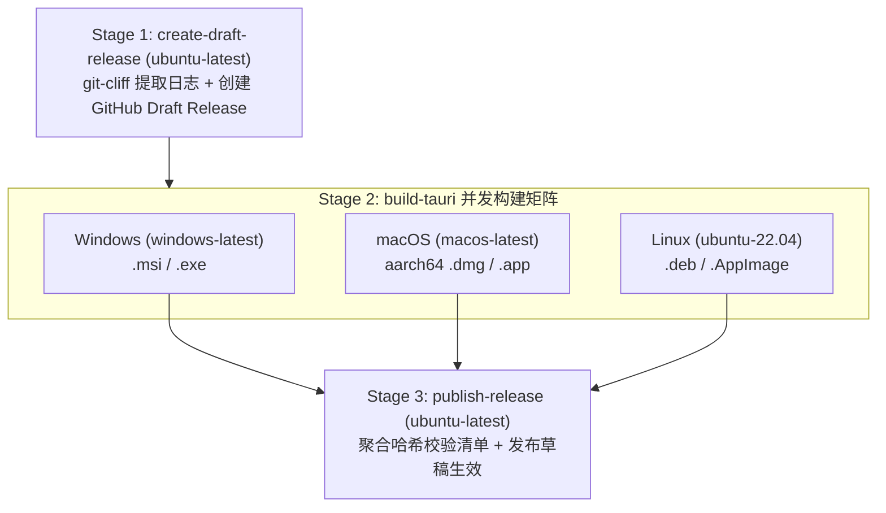

# ADR 0005: 多平台 CI/CD 矩阵构建与三阶段发布管道架构

## 状态 (Status)
已采纳 (Accepted) - 2026-10-06

## 背景 (Context)
`clip` 定位为极轻量、跨平台的桌面剪贴板历史管理器。随着底层平台抽象层 (PAL) 的确立，我们需要一个高确定性、工业级的自动化 CI/CD 流水线，以满足：
1. **多操作系统兼容性守卫**：在开发阶段拦截任意平台特有的破坏性代码（如缺失 `#[cfg(target_os = "...")]` 防护的系统 API 调用）；
2. **多平台发布产物覆盖**：自动化产出 Windows (`.msi`, `.exe`)、macOS (`.dmg`, `.app`) 与 Linux (`.deb`, `.AppImage`) 的标准安装包；
3. **并发竞态与发布质量防御**：多平台 Runner 并行构建时避免覆盖 Release 说明，且杜绝在某个平台构建失败时对外发布半成品。

## 决策 (Decision)

我们决定采用 **三阶段发布管道模型 (Three-Stage Release Pipeline)** 与 **三核并行持续集成矩阵 (Three-Node CI Matrix)**。

### 1. 持续集成守卫矩阵 (CI Matrix)
在 `.github/workflows/ci.yml` 中：
- **矩阵节点**：`windows-latest`、`macos-latest`、`ubuntu-22.04`；
- **平台依赖自适应**：
  - Linux: 自动化注入 `libwebkit2gtk-4.1-dev`, `libappindicator3-dev`, `librsvg2-dev`, `patchelf` 等 WebKit 与系统托盘依赖；
  - macOS / Windows: 依托 GitHub 官方 Runner 开箱即用环境；
- **校验内容**：在所有平台统一运行 `cargo check --all-targets` 与 `cargo test --lib`，前端统一执行 `pnpm lint`。

### 2. 三阶段发布管道架构 (Release Pipeline)
在 `.github/workflows/release.yml` 中拆解为依赖串联与矩阵并行的三阶段：

- **Stage 1 (准备阶段 - `create-draft-release`)**：
  - 运行于 `ubuntu-latest`；
  - 基于 `git-cliff` 自动提取 Conventional Commits 语义化版本变更说明；
  - 调用 GitHub API 预先创建标记为 `draft: true` 的 Release，输出 `release_id` 与 `upload_url`。
- **Stage 2 (矩阵编译打包阶段 - `build-tauri`)**：
  - 矩阵覆盖：
    - `windows-latest`: 产出 Windows 安装器；
    - `macos-latest`: 目标架构对齐 Apple Silicon (`aarch64-apple-darwin`)，产出 DMG 与压缩包；
    - `ubuntu-22.04`: 产出 Debian 包与独立 AppImage；
  - 统一通过 `tauri-apps/tauri-action` 挂载产物至 Stage 1 产出的 `release_id`，保持草稿状态，防止并发冲突。
- **Stage 3 (聚合与发布阶段 - `publish-release`)**：
  - 严格等待 Stage 2 的三平台节点全部成功；
  - 聚合所有 Release 资产生成统一的 `checksums.txt` (SHA-256) 校验清单文件；
  - 将 Draft Release 正式发布为公开可见的 Release。

### 3. macOS 代码签名平滑降级
- 支持可选环境变量 `APPLE_CERTIFICATE` / `APPLE_SIGNING_IDENTITY`。
- 若无开发者证书，自动以未签名模式完成 DMG 打包，并在文档中提供 Gatekeeper 绕过指令（`xattr -cr /Applications/clip.app`），确保开源社区零门槛交付。

## 影响与效果 (Consequences)
- **正面影响**：
  - 一键 Tag 推送即可同时交付 Windows、macOS、Linux 三大桌面平台的官方安装包。
  - 彻底规避多节点并发创建 Release 导致的内容覆盖或状态混乱。
  - 任何平台编译失败均不会对外暴露损坏的半成品 Release。
- **权衡与妥协**：
  - CI/CD 消耗更多的 GitHub Actions 跨平台 Runner 配额，但通过 `rust-cache` 与 `cancel-in-progress` 实现了并发开销的极小化。
